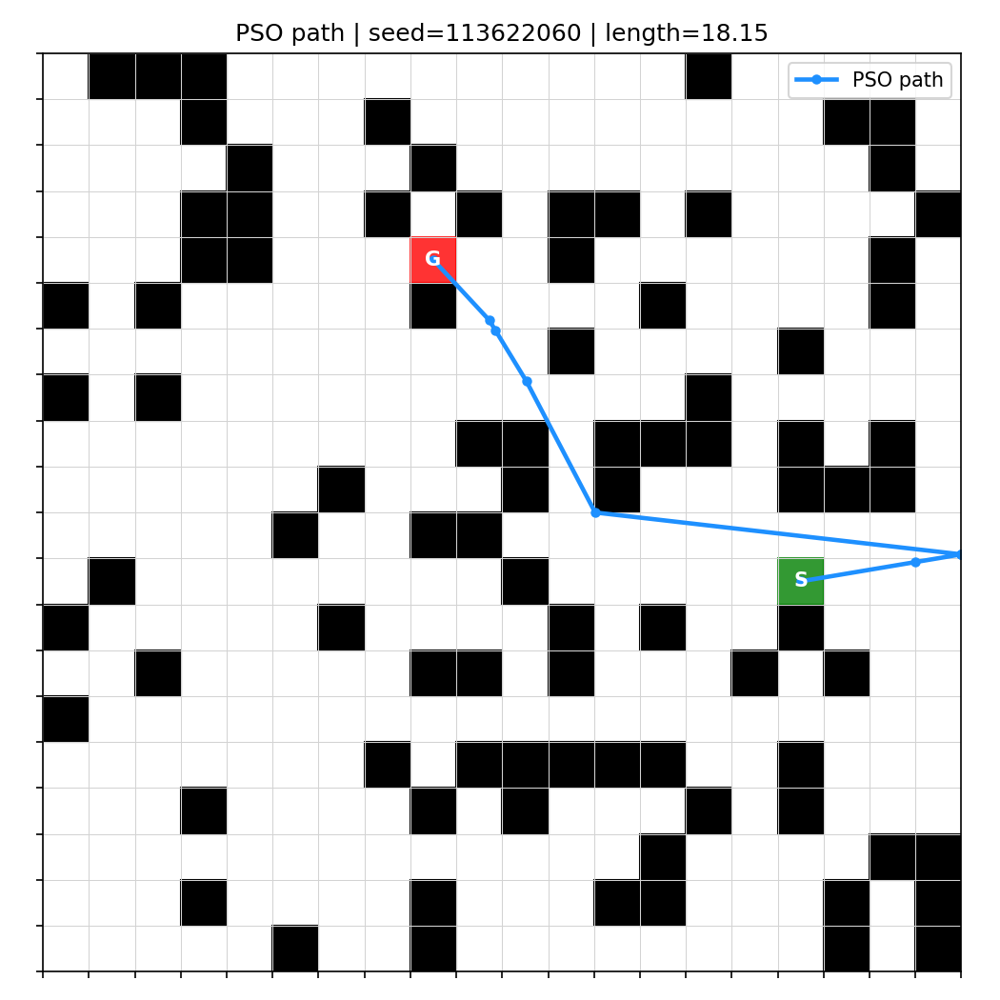
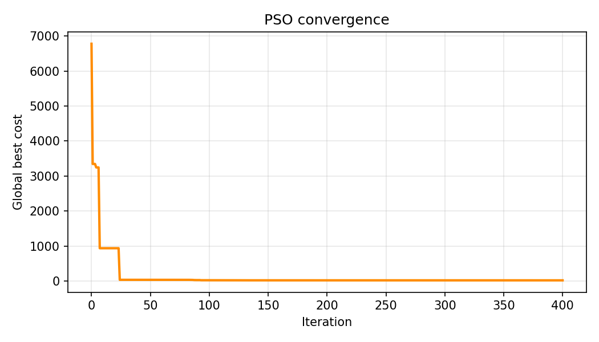
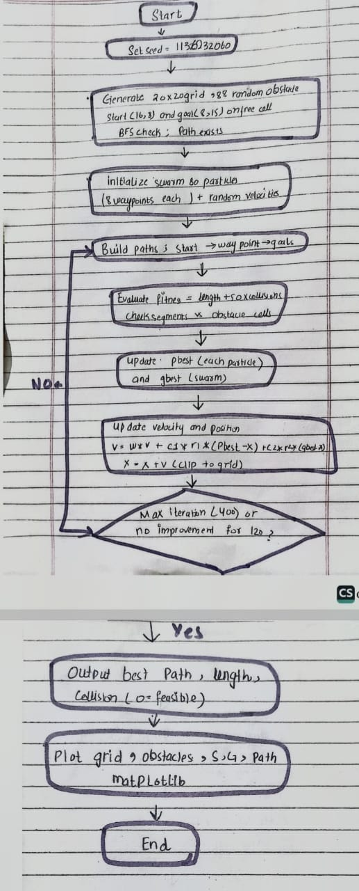

# Swarm Assignment 1: Swarm-Based Path Planning with Obstacles

Implement PSO to find a path from a start point to a goal point on a 2D grid, avoiding obstacles.

**Swarm Intelligence Lab – Assignment 1** · Bahria University, Dept. of Computer Science

| | |
|---|---|
| **Name** | Ayesha |
| **Roll Number** | 01-13622-060 |
| **Seed used** | `113622060` (roll number with dashes removed, passed to `random.seed()`) |

## Problem
Find a short, obstacle-free path from a start cell to a goal cell on a 2D grid using
**Particle Swarm Optimisation (PSO)**.

The problem instance is **generated programmatically** from the seed (nothing is hardcoded):
- Grid: 20 × 20 (`GRID_SIZE` in `src/config.py`)
- Obstacles: 22 % of cells (88 blocked cells) chosen with `random.seed(113622060)`
- Start and goal: random free cells from the same seed, at least 15 cells apart (Manhattan),
  and a BFS check guarantees that a path exists
- For this seed: start = `(16, 8)`, goal = `(8, 15)`

## Approach
**Particle encoding** – each particle is a list of 8 intermediate waypoints `(x, y)` in continuous
grid coordinates. The path is `start → wp1 → … → wp8 → goal` joined by straight segments.

**Fitness (minimised)**

```
cost = path length + 50 × (number of sampled points on the path that fall inside obstacle cells)
```

Each segment is sampled every 0.05 units; any sample in a blocked cell is counted as a collision.
A path with 0 collisions is feasible and its cost equals its length.

**PSO update rules**

```
v = w·v + c1·r1·(pbest − x) + c2·r2·(gbest − x)
x = x + v        (clipped to the grid)
```

- Inertia `w` decreases linearly from 0.9 to 0.4 (exploration → exploitation)
- `c1 = c2 = 1.8`, swarm size 80, max 400 iterations
- Velocity clamped to 20 % of the grid size
- **Stopping condition:** max iterations reached, or no improvement for 120 iterations

## Results (seed 113622060)
- Best path length: **18.148** (straight-line distance is 10.63)
- Collisions: **0** → feasible, obstacle-free path




Green = start (S), red = goal (G), black = obstacles, blue = PSO path.

## How to run
```bash
git clone <your-repo-url>
cd swarm-pathplanning-01-13622-060
pip install -r requirements.txt
python main.py            # saves results/path.png and results/convergence.png
python main.py --show     # also opens the matplotlib window
```
All parameters are in `src/config.py`. Runs are fully reproducible.

## Project structure
```
main.py            entry point
src/config.py      name, roll number, seed, grid and PSO parameters
src/grid.py        seeded obstacle / start / goal generation
src/pso.py         PSO algorithm, path decoding, collision check, fitness
src/visualize.py   matplotlib plots
results/           output images
docs/              hand-drawn flow diagram
```

## Hand-drawn flow diagram
Before submitting, draw the algorithm flow on paper, photograph it clearly, and save the photo as `docs/flow_diagram.jpg`. The photo must be your own hand-drawn diagram; it is not included yet.

Then embed it here:

```markdown

```
